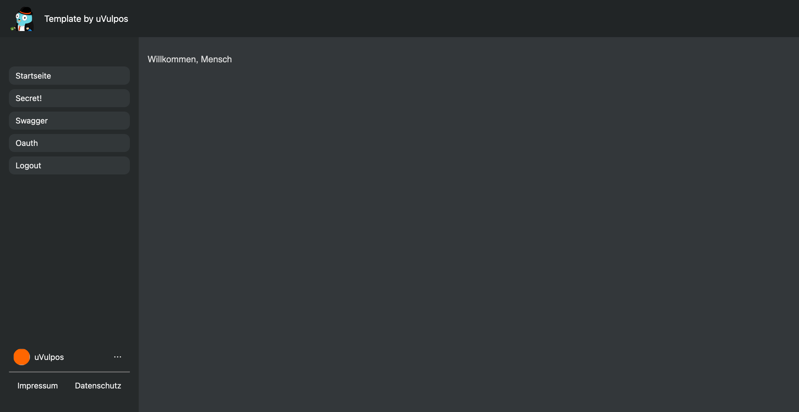
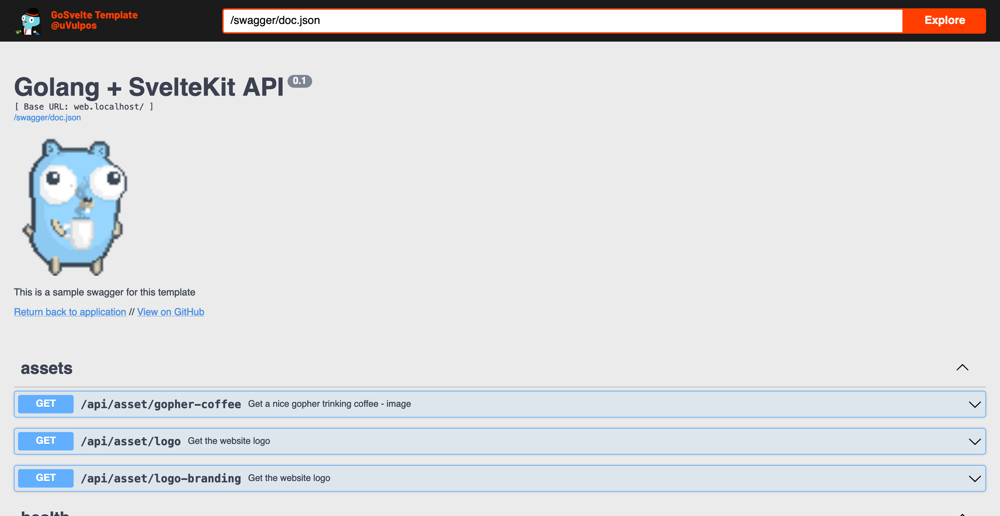

  

    <h1 align="center">Use Golang + Svelte ❤️</h1>

    
    
    
    
    

 

Golang and Svelte are some truely beautiful technologies and very powerful. But sometimes it is just overkill to deploy a docker compose stack or kubernetes cluster yet.

But don't worry, with this repository, I'm giving you the chance to make your infrastructure grow as your project. You start as a single binary that can be distributed and published like gitea and later on you can deploy it as independent microservices.

## Screenshots

  
  

## 🤝🏻 Thank you!

- For this awesome gopher on the landing page [umbralynx](https://github.com/umbralynx)!
- Gopher Assets by [egonelbre/gophers](https://github.com/egonelbre/gophers)
