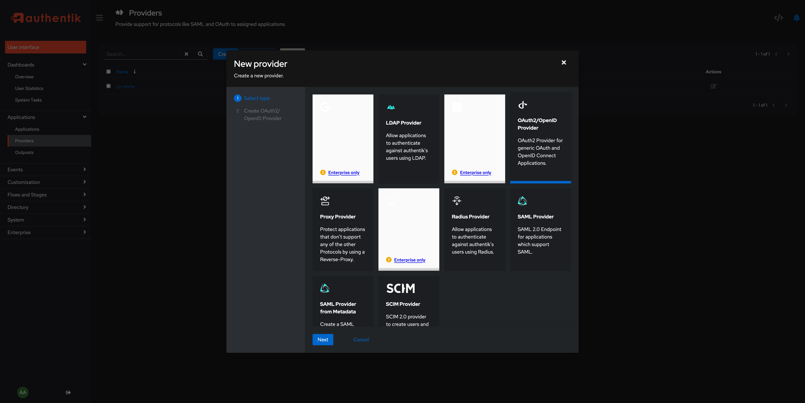
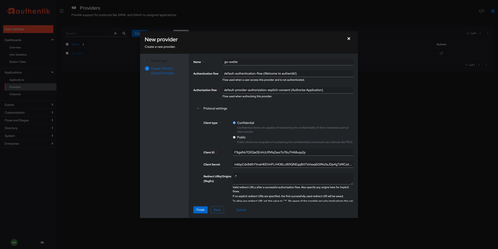
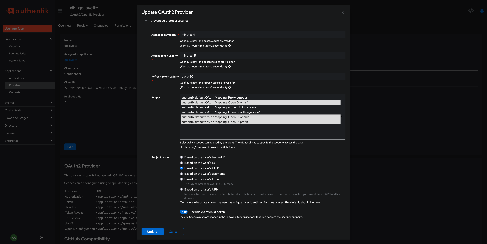
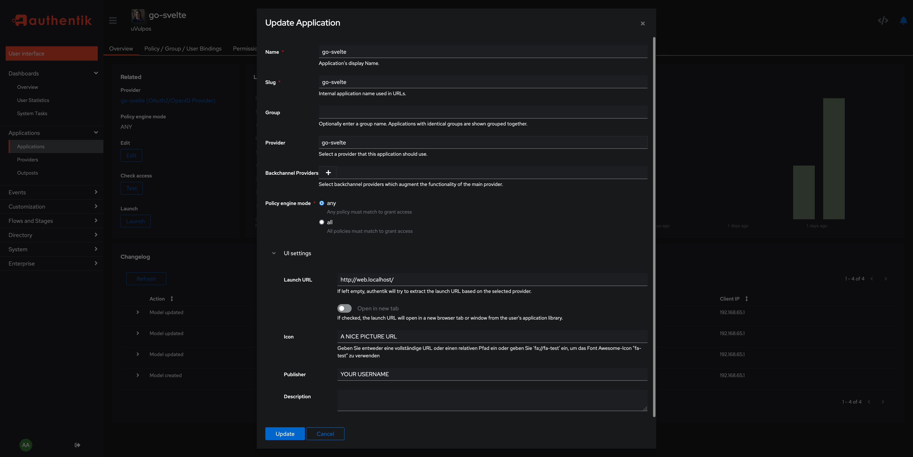
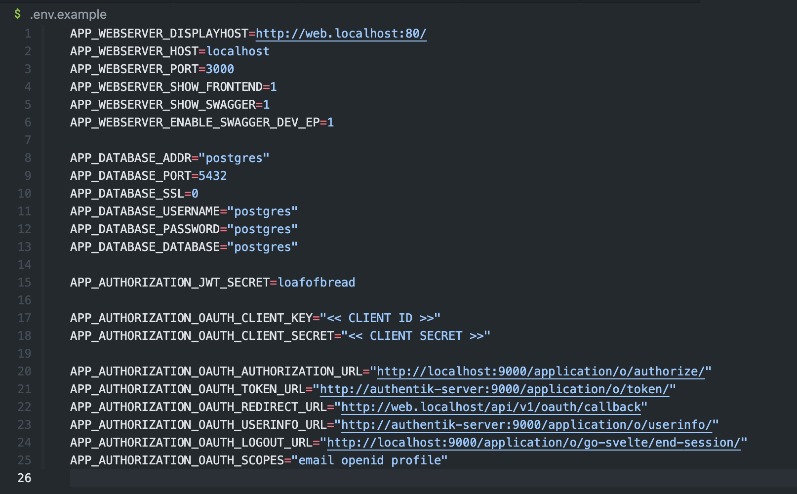

# Setup Authentik

To setup a (local) authentication provider, start your docker development stack `make dev` and connect to [your local authentik server (http://localhost:9000/)](http://localhost:9000/)

## Create Provider

First you need to create a new provider, that we can reference in an application:

## Create Application

After your provider is created, create a new application and reference your provider:

## Edit .env File

After you have the credentials, you can insert them into the env file. If you only working locally with `make dev`, you need to replace the Client Key + Secret. The URLs are matching with the endpoint. If you are working with a remote solution, you can inspect them in your provider view. Auto-OpenID-Configuration is not supportet yet.

After you edited the configuration, restart the docker stack by interrupting the signal and to restart the application by executing `make dev`
